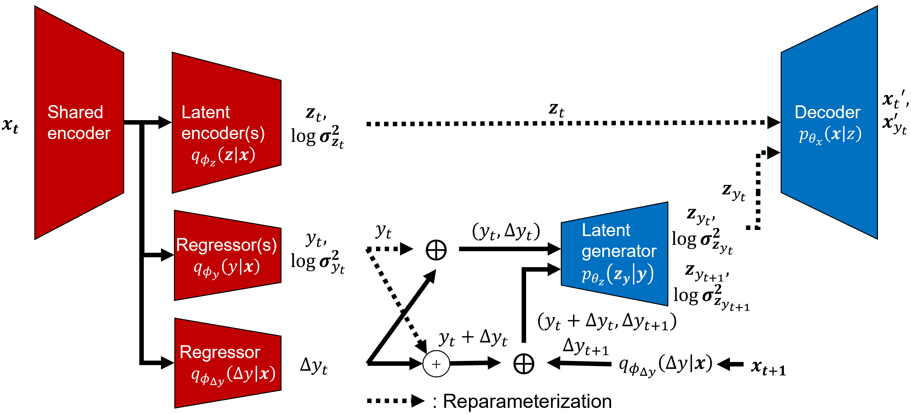

# Semisupervised-VAE-for-Regression-Application-on-Soft-Sensor
We present the development of a semi-supervised regression method using variational autoencoders (VAE), which is customized for use in soft sensing applications. We motivate the use of semi-supervised learning considering the fact that process quality variables are not collected at the same frequency as other process variables leading to many unlabelled records in operational datasets. These unlabelled records are not possible to use for training quality variable predictions based on supervised learning methods. Use of VAEs for unsupervised learning is well established and recently they were used for regression applications based on variational inference procedures. We extend this approach of supervised VAEs for regression (SVAER) to make it learn from unlabelled data leading to semi-supervised VAEs for regression (SSVAER), then we make further modifications to their architecture using additional regularization components to make SSVAER well suited for learning from both labelled and unlabelled process data. The probabilistic regressor resulting from the variational approach makes it possible to estimate the variance of the predictions simultaneously, which provides an uncertainty quantification along with the generated predictions. We provide an extensive comparative study of SSVAER with other publicly available semi-supervised and supervised learning methods on two benchmark problems using fixed-size datasets, where we vary the percentage of labelled data available for training. In these experiments, SSVAER achieves the lowest test errors in 11 of the 20 studied cases, compared to other methods where the second best gets 4 lowest test errors out of the 20.

# Results

Used for comparison:

The original VAE for regression, ***SVAER***: Qingyu Zhao, Ehsan Adeli, Nicolas Honnorat, Tuo Leng, and Kilian M. Pohl. 2019. Variational AutoEncoder for Regression: Application to Brain Aging Analysis. In Medical Image Computing and Computer Assisted Intervention – MICCAI 2019: 22nd International Conference, Shenzhen, China, October 13–17, 2019, Proceedings, Part II. Springer-Verlag, Berlin, Heidelberg, 823–831. https://doi.org/10.1007/978-3-030-32245-8_91

***SSAE***: Xiaofeng Yuan, Chen Ou, Yalin Wang, Chunhua Yang, Weihua Gui, A novel semi-supervised pre-training strategy for deep networks and its application for quality variable prediction in industrial processes, Chemical Engineering Science, Volume 217, 2020, 115509, ISSN 0009-2509, https://doi.org/10.1016/j.ces.2020.115509.

***SSSMM***: W. Shao, Z. Ge, Z. Song and J. Wang, "Semisupervised Robust Modeling of Multimode Industrial Processes for Quality Variable Prediction Based on Student's t Mixture Model," in IEEE Transactions on Industrial Informatics, vol. 16, no. 5, pp. 2965-2976, May 2020, doi: 10.1109/TII.2019.2902560.

***FCNN***: Fully connected neural network.

The number of layers and the number of neurons of each layer are the same for the quality variable inference part of each method.

## Results on debutanizer dataset

| Label% | 1%              | 2%              | 5%              | 10%             | 14.2%           | 20%             | 25%             | 33%             | 50%             | 100%            |
|--------|-----------------|-----------------|-----------------|-----------------|-----------------|-----------------|-----------------|-----------------|-----------------|-----------------|
| SSVAER | 0.0764          | ***0.0522*** | 0.0561          | 0.0498          | ***0.0476*** | ***0.0470*** | ***0.0480*** | ***0.0476*** | ***0.0469*** | 0.0516          |
| SVAER  | ***0.0606*** | 0.0588          | 0.0541          | ***0.0478*** | 0.0507          | 0.0589          | 0.0545          | 0.0490          | 0.0540          | 0.0543          |
| SSAE   | 0.0822          | 0.0526          | ***0.0494*** | 0.0495          | 0.0485          | 0.0529          | 0.0496          | 0.0512          | 0.0521          | ***0.0462*** |
| FCNN   | 0.0852          | 0.0541          | 0.0588          | 0.0517          | 0.0483          | 0.0487          | 0.0487          | 0.0493          | 0.0493          | 0.0495          |
| SSSMM  | NA              | NA              | NA              | NA              | NA              | 0.0525          | 0.0731          | 0.0629          | 0.0647          | NA              |

## Results on sulfur recovery unit dataset

| Label% | 1%              | 2%              | 5%              | 10%             | 14.2%           | 20%             | 25%             | 33%             | 50%             | 100%            |
|--------|-----------------|-----------------|-----------------|-----------------|-----------------|-----------------|-----------------|-----------------|-----------------|-----------------|
| SSVAER | ***0.0566*** | 0.0484          | ***0.0347*** | 0.0322          | 0.0289          | ***0.0314*** | ***0.0275*** | 0.0285          | ***0.0268*** | 0.0290          |
| SVAER  | 0.0568          | 0.0506          | 0.0354          | ***0.0322*** | ***0.0275*** | 0.0317          | 0.0282          | 0.0320          | 0.0302          | 0.0315          |
| SSAE   | 0.0603          | 0.0499          | 0.0410          | 0.0347          | 0.0308          | 0.0358          | 0.0287          | ***0.0254*** | 0.0274          | ***0.0270*** |
| FCNN   | 0.0653          | ***0.0459*** | 0.0461          | 0.0342          | 0.0330          | 0.0362          | 0.0341          | 0.0298          | 0.0367          | 0.0382          |
| SSSMM  | NA              | NA              | NA              | 0.0580          | NA              | 0.0351          | 0.0318          | 0.0560          | 0.0445          | NA              |

## Line plots of the two benchmark datasets

## Confidence interval plot

By utilizing the estimated variance along with the quality variable prediction, the confidence interval can be shown as:

Demos:

demo_debut.ipynb

demo_sru.ipynb